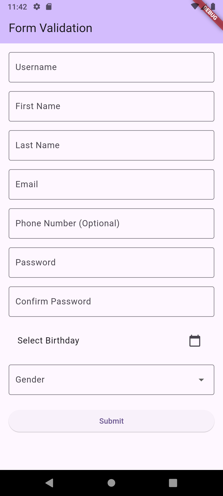

# Form with Validation

This Flutter application demonstrates a comprehensive user registration form with various input fields and client-side validation.

## Features:

- **User Registration Form:** A single form to capture user details.
- **Mandatory Fields:**
  - Username
  - First Name
  - Last Name
  - Email (with format validation)
  - Password (with minimum length validation)
  - Password Confirmation (must match password)
  - Birthday (date picker)
  - Gender (dropdown selection)
- **Optional Field:**
  - Phone Number
- **Client-Side Validation:** Ensures data integrity before submission.
- **Responsive UI:** Built with Flutter's widgets for a consistent experience across devices.

## Screenshot

Here's a screenshot of the application:

| Screenshot |
| :---: |
|  |

## How to Run:

1. Clone this repository.
2. Navigate to the project directory.
3. Run `flutter pub get` to install dependencies.
4. Run `flutter run` to launch the application.
